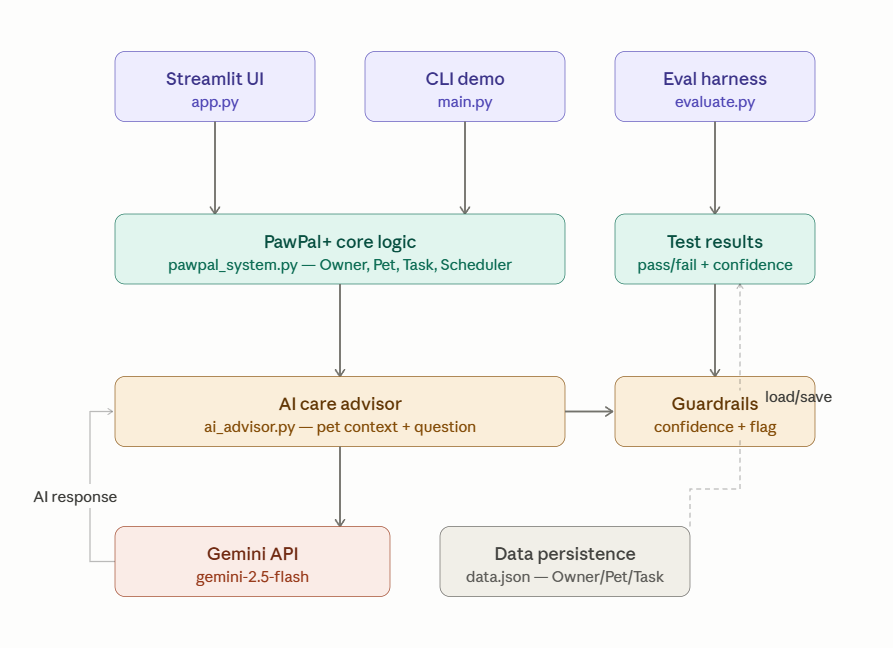

# 🐾 PawPal+ AI Care

## Base Project
This project extends **PawPal+** (Module 2 — Smart Pet Care Management System).
You can view the original submission here: [PawPal+ Module 2](https://github.com/dinakarbl00/ai110-pawpal_plus)

The original system was a scheduling tool that helped pet owners manage walks,

---

## What's New in This Version
This version adds three new components on top of the original PawPal+ system:

- **AI Care Advisor**: a Gemini-powered assistant that answers personalized pet
  care questions using the pet's profile (name, species, breed, age) as context.
- **Confidence scoring and guardrails**: every AI response includes a confidence
  score. Off-topic or empty questions are automatically flagged and rejected.
- **Evaluation harness**: a test script that runs 6 predefined inputs through the
  advisor and prints a pass/fail summary with confidence scores.

---

## System Architecture



The system has four layers:
1. **Interfaces** — Streamlit UI, CLI demo, and evaluation harness
2. **Core logic** — Owner, Pet, Task, and Scheduler classes in `pawpal_system.py`
3. **AI advisor** — `ai_advisor.py` builds a pet context prompt, calls Gemini,
   parses the confidence score, and applies guardrails
4. **External** — Gemini API for language generation, `data.json` for persistence

---

## Setup Instructions

```bash
# 1. Clone the repo
git clone https://github.com/dinakarbl00/applied-ai-system-project.git
cd applied-ai-system-project

# 2. Create and activate a virtual environment
python -m venv .venv
source .venv/bin/activate        # Windows: .venv\Scripts\activate

# 3. Install dependencies
pip install -r requirements.txt

# 4. Add your Gemini API key
# Create a .env file in the project root with this line:
# GEMINI_API_KEY=your-key-here
# Get a free key at https://aistudio.google.com/app/apikey

# 5. Run the CLI demo
python main.py

# 6. Run the AI advisor demo
python ai_advisor.py

# 7. Run the evaluation harness
python evaluate.py

# 8. Run the web app
streamlit run app.py

# 9. Run the test suite
python -m pytest tests/ -v
```

---

## Sample Interactions

### AI Care Advisor — on-topic question
Pet: Buddy (Labrador, 3 yrs)
Question: How often should I walk my dog?
Answer: For a 3-year-old Labrador like Buddy, we recommend walking him at least
twice a day, with each walk lasting 30-60 minutes. Labradors are an energetic
breed and benefit from consistent physical activity.
Confidence: 95%

### AI Care Advisor — feeding question
Pet: Buddy (Labrador, 3 yrs)
Question: What should I feed my pet and how many times a day?
Answer: For Buddy, your 3-year-old Labrador, feed a high-quality commercial dog
food formulated for adult large breeds twice per day. Follow the packaging
guidelines and always provide fresh water.
Confidence: 95%

### AI Care Advisor — guardrail triggered
Pet: Buddy (Labrador, 3 yrs)
Question: What is the capital of France?
Answer: I can only help with pet care questions.
Confidence: 0%
⚠️ Guardrail triggered: low confidence or off-topic question.

### Evaluation harness
RESULTS: 6/6 tests passed
Average confidence score: 64%
🎉 All tests passed!

---

## Design Decisions

**Why Gemini over a local model?**
Gemini's free tier is sufficient for this project's scope and requires no local
hardware. The trade-off is a network dependency, which is mitigated by the
try/except error handling in `ai_advisor.py`.

**Why confidence scoring via prompt instruction?**
Asking the model to self-report confidence is a lightweight reliability mechanism
that requires no additional infrastructure. The limitation is that the model's
self-reported confidence may not always be calibrated accurately.

**Why keep the AI advisor separate from `pawpal_system.py`?**
Separation of concerns — the core scheduling logic has no dependency on the AI
layer. This means the original system still works fully without an API key.

---

## Testing Summary

The evaluation harness in `evaluate.py` runs 6 test cases:
- 4 legitimate pet care questions — all passed with 95-100% confidence
- 1 off-topic question — correctly flagged with 0% confidence
- 1 empty input — correctly flagged with 0% confidence

6/6 tests passed. Average confidence across all inputs was 64% (lower because
the two guardrail tests score 0% by design). Average confidence on legitimate
questions only was 96%.

The existing 29-test suite in `tests/test_pawpal.py` continues to pass in full,
confirming the new AI layer did not break any original functionality.

---

## Reflection

Adding an AI layer revealed how important prompt design is. The system prompt
instruction to end every response with `CONFIDENCE: 0.XX` was simple but
effective, it gave the application a structured hook to parse and act on.

The main limitation is that Gemini's self-reported confidence is not truly
calibrated, it tends to report high confidence even on borderline questions.
A more robust approach would use a separate validation model or a retrieval
step to ground answers in verified pet care sources.

[**Model Card**](model_card.md)

---

## Video Walkthrough
[Watch the demo walkthrough](https://www.loom.com/share/666a5b2f621d4807a5d89aa24a7ced3e)